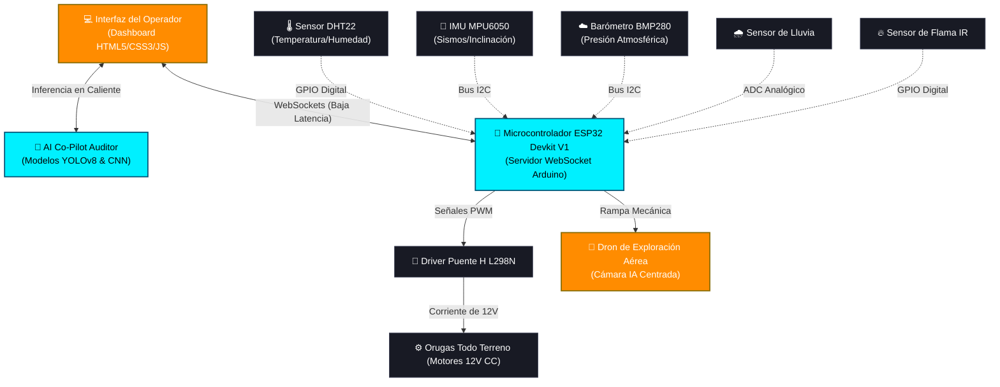

<div align="center">

# ⚡ ARGOS SYSTEM v6.20 ⚡

[](#)
[](#)
[](#)
[](#)
[](SECURITY.md)

```text
 █████╗ ██████╗  ██████╗  ██████╗ ███████╗
██╔══██╗██╔══██╗██╔════╝ ██╔═══██╗██╔════╝
███████║██████╔╝██║  ███╗██║   ██║███████╗
██╔══██║██╔══██╗██║   ██║██║   ██║╚════██║
██║  ██║██║  ██║╚██████╔╝╚██████╔╝███████║
╚═╝  ╚═╝╚═╝  ╚═╝ ╚═════╝  ╚═════╝ ╚══════╝
```

**Plataforma Autónoma de Monitoreo Ambiental, Prevención de Desastres, Inteligencia Artificial y Educación STEAM**  
*Un proyecto de código abierto, local-first y encriptado en la nube para la resiliencia civil de comunidades.*

---

[🌐 Ver Aplicación en Producción](https://gmph2007.github.io/sistemateos.github.oi/) • [⚖️ Términos Legales](#-política-de-privacidad-y-legalidad) • [👥 Nuestro Equipo](#-equipo-de-desarrollo-e-innovación) • [🛡️ Política de Seguridad](SECURITY.md)

</div>

---

## 📖 Descripción General

**ARGOS** es un ecosistema tecnológico multi-agente de vanguardia (terrestre y aéreo) diseñado para patrullar, monitorear y mitigar riesgos ambientales en la región de Paita y Piura. El proyecto combina hardware de código abierto, telemetría IoT de baja latencia mediante WebSockets, visión artificial impulsada por modelos de **Inteligencia Artificial (YOLOv8 & CNN)**, y una interfaz de mando interactiva enfocada en la formación de resiliencia civil y educación STEAM.

---

## 👥 Equipo de Desarrollo e Innovación

El proyecto ha sido fundado, diseñado y programado por estudiantes de la carrera de **APSTI** (Arquitectura de Plataformas y Servicios de Tecnologías de la Información) del **Instituto de Educación Superior Tecnológico Público "Hermanos Cárcamo"** (Paita):

*   **Misael Pintado** (Co-Fundador y Programador Fullstack): Arquitectura del software, programación del firmware ESP32, desarrollo de la telemetría interactiva IoT, sistema de cifrado de contraseñas, medidor de fortaleza y base de datos con sincronización en la nube.
*   **Dayron Urbina Zapata** (Co-Fundador e Ingeniero de Robótica): Modelado tridimensional del chasis del rover, ensamblaje de la tracción mecánica por orugas, diseño físico del hangar y acople de sistemas electromecánicos.

> 💡 *"Trabajando unidos en equipo, demostramos que la pasión tecnológica y el esfuerzo coordinado lo logran todo."*

---

## 🧠 Módulo de Inteligencia Artificial (AI Co-Pilot)

ARGOS incorpora un núcleo de inferencia inteligente y visión artificial táctica:
*   **Detección Visual en Tiempo Real (YOLOv8):** Clasifica de forma instantánea focos de fuego, personas atrapadas o fisuras estructurales en el pavimento mediante el feed de video del dron.
*   **Redes Neuronales Convolucionales (CNN):** Evalúan patrones visuales para categorizar el nivel de daño del terreno y estimar riesgos.
*   **Panel de Auditoría de Telemetría IA:** Un monitor interactivo en el dashboard que audita las variables físicas de los sensores (DHT22, BMP280, MPU6050) y genera diagnósticos de riesgo autónomos (Alertas sísmicas por oscilación, riesgo térmico por incendio o advertencias barométricas de tormentas) con latencias de inferencia de 8-16ms.

---

## 🔐 Protocolo de Seguridad Multicapa y Base de Datos

La plataforma web implementa seguridad informática extrema y control de accesos:
*   **Firma Humana (Anti-Bot CAPTCHA):** Sistema interactivo que ejecuta un escaneo visual de seguridad antes de permitir el acceso al nodo del operador.
*   **Sincronización en la Nube Protegida:** Las cuentas creadas se resguardan de forma segura en un depósito remoto encriptado y cifrado por cabecera tokenizada (`Security-key`), permitiendo iniciar sesión en cualquier dispositivo móvil o PC sin perder tu registro.
*   **Cifrado Salted SHA-256:** Las contraseñas de operador son encriptadas localmente usando algoritmos hash salteados con soporte Unicode (tildes, eñes y emojis).
*   **Medidor de Fortaleza de Clave:** Barra interactiva que audita la complejidad de la clave en tiempo real (Insegura / Moderada / Impenetrable).
*   **Escudo de Inspección de Código:** Bloquea clics derechos y accesos por teclas de depurador (`F12`, `Ctrl+Shift+I`, etc.) con tonos sonoros disuasorios.

---

## 📊 Arquitectura del Ecosistema

El siguiente diagrama de flujo esquematiza las interconexiones físicas y los canales de comunicación lógicos de ARGOS:



---

## 🛠️ Especificaciones de Hardware y Sensores

| Componente | Tipo de Sensor / Acción | ¿Por qué se utiliza? |
| :--- | :--- | :--- |
| **ESP32 Devkit V1** | Microcontrolador central | CPU doble núcleo con conectividad WiFi/Bluetooth nativa para enlaces de baja latencia. |
| **MPU-6050** | Giroscopio e Inclinómetro | Audita en tiempo real las ondas sísmicas de tierra y previene volcaduras en pendientes empinadas. |
| **DHT22** | Termohigrómetro de precisión | Monitorea la humedad y temperatura ambiente para auditar frentes cálidos o secos. |
| **BMP280** | Barómetro Bosch | Registra la presión atmosférica en hPa para la predicción temprana de tormentas severas. |
| **Sensor de Lluvia** | Placa capacitiva conductiva | Alerta ante la caída de agua para activar protocolos preventivos de inundaciones. |
| **Sensor de Flama** | Receptor infrarrojo de llama | Reacciona en milisegundos ante la radiación térmica emitida por fuegos accidentales. |
| **L298N H-Bridge** | Controlador del motor | Regula la potencia de 12V hacia las orugas motrices mediante señales analógicas PWM del ESP32. |

---

## 🎮 Terminal Arcade STEAM (Juegos Educativos)

Para incentivar el aprendizaje interactivo y la toma de decisiones críticas en emergencias, la plataforma integra tres simuladores gamificados:

1.  **🏆 Trivia de Prevención (Kahoot Style):** Desafío cognitivo de 8 preguntas sobre hardware y prevención, con temporizador de 15 segundos y racha de multiplicadores. Alcanzar **800+ puntos** otorga el rango de *Operador Experto*.
2.  **🗺️ Simulador de Misiones Tácticas:** Mapa vintage interactivo con overlays holográficos. Al enrutar el robot ARGOS hacia incidentes de sismo, fuego o inundación, la interfaz genera un **trazado vectorial SVG de trayectoria naranja neón animado**.
3.  **🚁 Estabilizador de Dron Aéreo:** Simulador físico en tiempo real de vuelo estacionario. Controla la sustentación del dron frente a ráfagas de viento variables (con alertas e indicadores en pantalla) usando botones de impulso o la barra espaciadora.

---

## 🎮 Gamificación: Desbloqueo del Rol "Controlador Experto"

ARGOS premia la excelencia técnica de sus usuarios. Al completar con éxito **Todas las Misiones** en el Simulador o calificar como **Operador de Nivel Experto** en la Trivia:
*   Se desbloquea de manera permanente en el navegador el rol exclusivo **Controlador Experto 🏆**.
*   El usuario se destaca en el panel con una **Corona Dorada (`fa-crown`)** y un resplandor de neón áureo.
*   Otorga **Acceso Administrativo Completo** a la consola del docente, controles físicos del rover y telemetría del dron sin requerir contraseñas.

---

## 🔒 Política de Privacidad y Legalidad

*   **Local-First / Privacidad Absoluta:** Toda tu información, contraseñas de sesión simuladas y puntuaciones de arcade se guardan de forma local en tu navegador utilizando `localStorage`.
*   **Sin Rastreo:** No recopilamos, rastreamos ni enviamos datos a servidores externos. Tu privacidad es nuestra absoluta prioridad.
*   **Licencia GNU AGPLv3:** El software está liberado bajo la licencia de software libre **GNU Affero General Public License v3 (AGPL-3.0)**, garantizando que el código permanezca abierto y auditable para toda la comunidad.

---

## 🌐 Aplicación Web en Producción (Demo en Vivo)

Puedes acceder de manera directa al sistema ARGOS interactivo en producción sin necesidad de descargar o instalar el código haciendo clic en el siguiente enlace:

👉 **[https://gmph2007.github.io/sistemateos.github.oi/](https://gmph2007.github.io/sistemateos.github.oi/)**

---

## 🚀 Guía de Despliegue Local

1.  Clona el repositorio en tu ordenador:
    ```bash
    git clone https://github.com/GMPH2007/sistemateos.github.oi.git
    ```
2.  Abre el archivo `index.html` en tu navegador web moderno.
3.  *(Opcional)* Empareja el microcontrolador ESP32 ejecutando el servidor WebSocket provisto en los esquemáticos para sincronizar la telemetría física.
